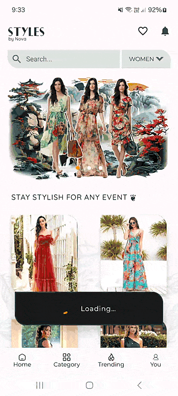
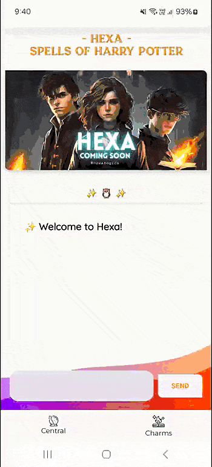
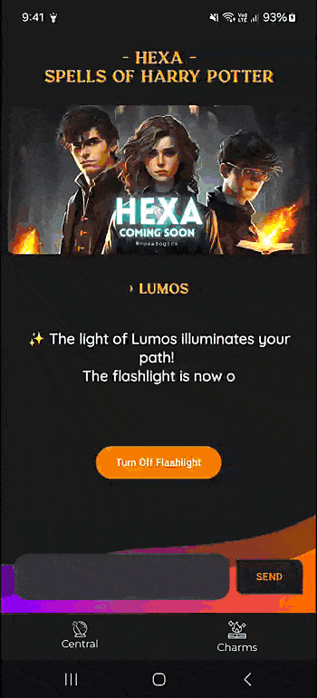

 <h2 align="center">  <strong> I go by Nova 𐂃༺ </strong><br> 
 𒄆 <em> { >/ Shavinda Dissanayake }</em> 𒄆  </h2>


<h3 align="center">Mobile Engineer | UI / UX Engineer </h3>

<div align="center">
꘏ ꘏ ꘏ ꘏ ꘏ ꘏ ꘏ ꘏ ꘏
</div>
<br/> 

𒆙 **Senior Software Engineer** with **6+** years of experience in mobile app development, primarily specializing in **Android**.
<br/> 

𒆙 Skilled in core Android architecture and best practices, including Jetpack, MVVM,  MVI.
<br/> 

𒆙 Experienced in building cross platform apps with React Native, Flutter, and Ionic Capacitor.
<br/>  

 <!--  ▄︻̷̿┻̿═━一  ♞▀▄▀▄♝▀▄ 𒅒𒈔𒅒𒇫𒄆 🀢 🀣 🀦 🀤 🀥 𓅇
🀥𐦐   𐦆  𐂂   𐦖  𐂃  𖤍 🜲  *ੈ✩‧₊˚༺☆༻*ੈ✩‧₊˚𓅓ᯓ★ ᯓ★:
 𒆙 🙤 ꘏ ꘏ ꘏ ꘏  𐂃  ꘏ 𖤍  ꘏ 𐂂  ꘏  ꘏ ꘏ ꘏ 🙦 𒆙  -->

<h3>  A little more about me...  </h3>

| [Name] <br> Shavinda Dissanayake | [Education] <br> BSc in IT from SLIIT, Sri Lanka | [Current Occupation] <br> Senior Software Engineer |
| - | - | - |


|  Interests  |
| - | 
| **Commenting on Code Like a Poet** - *Because every line tells a story* |
| **Debugging Life Choices** - *Figuring out where it all went wrong* |
|**Code Commenting Art** - *Writing cryptic messages for future generations*  |
| **Coffee Compiler** - *Running on Java (coffee) all day long* | 
| **Over engineering Simple Problems for fun** - *Turning "Hello World" into a Microservice, <br>Because why not?* | 
| **Refactoring for Sport** - *Because it can always be cleaner* | 
| **IDE Personalization** - *Making that workspace feel like home* | 


| **Technical Skills** |
| --- |
| **Languages & Technologies:** <br> Android (Java, Kotlin), Flutter (Dart), React Native (JS), C#, Swift, <br> Java SE, RxJava, AIDL, Dagger, OpenCV, BLE, OpenGL |
| **Tools & Software:** <br> Android Studio, IntelliJ IDEA, VS Code, Visual Studio, Unity (2D),  Postman, Adobe CC |
| **Databases:** <br> MySQL, MS-SQL, SQLite, Firebase, Room DB |
| **Android Architecture Components:** <br> Lifecycle-aware components, Compose (UI Toolkit), ViewModel, LiveData, Navigation,  <br> View Binding, Data Binding, Room DB, WorkManager, DataStore , Hilt , |
| **Design Patterns:** <br> MVI, MVVM, MVP, MVC, Facade, Observer, BLoC |
| **Version Control:** <br> GitHub, GitLab |


<details>
<summary>  Quick Info </summary>

<br>

[]()

 </details>

<details>
<summary>  Profile Details </summary>

<br>

[]()

 </details>

 <br>

 

##

<div align="center">

[]()
[]()
<!-- <br/> -->

</div>

##

<div align="center">

ᴛᴇᴄʜ ꜱᴛᴀᴄᴋ / ꜱᴋɪʟʟꜱ <br/> 

[](#)
[](#)
[](#)
[](#)
[](#)
[](#)

[](#)
[](#)
[](#)
[](#)
[](#)
[](#)
[](#)

[](#)
[](#)
[](#)
[](#)
[](#)
[](#)
[](#)


##

 <details>
 <summary> 𒄆 ᴘᴜʙʟɪᴄ ᴄᴏɴᴛʀɪʙᴜᴛɪᴏɴ ʀᴀɴᴋɪɴɢ 𒄆<br>< ꜱʀɪ ʟᴀɴᴋᴀ ></summary>

```yaml
https://committers.top/sri_lanka.html
```
</details>  


  


</div>


##

<div align="center">

 \- ᴜɴᴅᴇʀᴡᴀʏ ᴘʀᴏᴊᴇᴄᴛꜱ -

 [𝐒𝐓𝐘𝐋𝐄𝐒 𝚋𝚢 𝙽𝚘𝚟𝚊](https://github.com/NovaLogics/styles-by-nova-android-app) &ensp; ✦ &ensp;
 [𝐇𝐄𝐗𝐀](https://github.com/NovaLogics/hexa-harry-potter-android-app)







</div>

 ##

 <details>
 <summary> Reflection Note </summary>

<br>

```Ada
-- with Ada.Text_IO; use Ada.Text_IO; procedure

EVERYTHING is
    CHANGING : constant String := "ALWAYS";
begin
   Put_Line ( 
    "THE ONLY CONSTANT IS CHANGE" 
    );
end EVERYTHING;
```

 </details>


 <!-- <samp>♖ MOST ACTIVE USER RANKING ♖ </samp> -->
<!-- https://user-badge.committers.top/sri_lanka/NovaLogics.svg  -->

 <!-- <samp>♖⠀ TOP CONTRIBUTOR RANKING ♖ </samp>  -->
  <!-- https://user-badge.committers.top/sri_lanka_public/NovaLogics.svg  -->
<!-- 
[]()  -->
